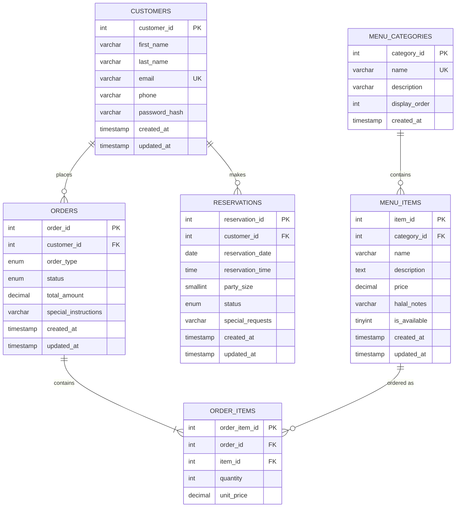

# Database Design — Zabiha Halal

Target RDBMS: **MySQL 8.0+** (InnoDB storage engine, `utf8mb4` charset)

This schema is normalized to **Third Normal Form (3NF)**:

- Every table has a single-column surrogate primary key (no repeating groups — 1NF).
- Every non-key column depends on the whole primary key, not part of it (no composite keys with partial dependencies exist — 2NF).
- No non-key column depends on another non-key column. The one apparent exception is `order_items.unit_price`, which is **not** a normalization violation: it is a historical snapshot of `menu_items.price` at the moment the order was placed (menu prices change over time; an order must remain accurate to what the customer was actually charged). It is not derivable from any other column in `order_items` and is not functionally dependent on another non-key attribute in the same table — 3NF holds.
- `orders.total_amount` is a cached/denormalized aggregate of `SUM(order_items.quantity * order_items.unit_price)`, intentionally stored (not purely derived) for read performance and historical integrity; it is written once, inside the same transaction that creates the order and its line items, and is never independently edited.

## Entity-Relationship Diagram

## Relationships

| Relationship | Cardinality | Notes |
|---|---|---|
| `customers` → `orders` | 1 : N | A customer can place many orders; an order belongs to exactly one customer. FK `orders.customer_id` `ON DELETE RESTRICT` — a customer with order history cannot be deleted. |
| `customers` → `reservations` | 1 : N | A customer can make many reservations. FK `reservations.customer_id` `ON DELETE RESTRICT`. |
| `menu_categories` → `menu_items` | 1 : N | A category has many items; an item belongs to exactly one category. FK `menu_items.category_id` `ON DELETE RESTRICT` — a category with items cannot be deleted. |
| `orders` → `order_items` | 1 : N | An order has one or more line items. FK `order_items.order_id` `ON DELETE CASCADE` — deleting an order removes its line items. |
| `menu_items` → `order_items` | 1 : N | A menu item can appear on many order line items. FK `order_items.item_id` `ON DELETE RESTRICT` — a menu item referenced by historical orders cannot be hard-deleted (use `is_available = 0` instead). |

`order_items` is the associative/junction table resolving the M:N relationship between `orders` and `menu_items`.

## Table Definitions

### customers

| Column | Type | Constraints |
|---|---|---|
| customer_id | `INT UNSIGNED` | PK, AUTO_INCREMENT |
| first_name | `VARCHAR(50)` | NOT NULL |
| last_name | `VARCHAR(50)` | NOT NULL |
| email | `VARCHAR(120)` | NOT NULL, UNIQUE |
| phone | `VARCHAR(20)` | NOT NULL |
| password_hash | `VARCHAR(255)` | NOT NULL — bcrypt hash, never plaintext |
| created_at | `TIMESTAMP` | NOT NULL, DEFAULT CURRENT_TIMESTAMP |
| updated_at | `TIMESTAMP` | NOT NULL, DEFAULT CURRENT_TIMESTAMP ON UPDATE CURRENT_TIMESTAMP |

### menu_categories

| Column | Type | Constraints |
|---|---|---|
| category_id | `INT UNSIGNED` | PK, AUTO_INCREMENT |
| name | `VARCHAR(80)` | NOT NULL, UNIQUE |
| description | `VARCHAR(255)` | NULL |
| display_order | `INT UNSIGNED` | NOT NULL, DEFAULT 0 |
| created_at | `TIMESTAMP` | NOT NULL, DEFAULT CURRENT_TIMESTAMP |

### menu_items

| Column | Type | Constraints |
|---|---|---|
| item_id | `INT UNSIGNED` | PK, AUTO_INCREMENT |
| category_id | `INT UNSIGNED` | NOT NULL, FK → menu_categories.category_id |
| name | `VARCHAR(120)` | NOT NULL |
| description | `TEXT` | NULL |
| price | `DECIMAL(8,2)` | NOT NULL, CHECK (price >= 0) |
| halal_notes | `VARCHAR(255)` | NULL — certification body / notes |
| is_available | `TINYINT(1)` | NOT NULL, DEFAULT 1 |
| created_at | `TIMESTAMP` | NOT NULL, DEFAULT CURRENT_TIMESTAMP |
| updated_at | `TIMESTAMP` | NOT NULL, DEFAULT CURRENT_TIMESTAMP ON UPDATE CURRENT_TIMESTAMP |

Indexes: `idx_menu_items_category`, `idx_menu_items_available`.

### orders

| Column | Type | Constraints |
|---|---|---|
| order_id | `INT UNSIGNED` | PK, AUTO_INCREMENT |
| customer_id | `INT UNSIGNED` | NOT NULL, FK → customers.customer_id |
| order_type | `ENUM('pickup','delivery','dine-in')` | NOT NULL, DEFAULT 'pickup' |
| status | `ENUM('pending','confirmed','preparing','ready','completed','cancelled')` | NOT NULL, DEFAULT 'pending' |
| total_amount | `DECIMAL(10,2)` | NOT NULL, DEFAULT 0.00, CHECK (total_amount >= 0) |
| special_instructions | `VARCHAR(500)` | NULL |
| created_at | `TIMESTAMP` | NOT NULL, DEFAULT CURRENT_TIMESTAMP |
| updated_at | `TIMESTAMP` | NOT NULL, DEFAULT CURRENT_TIMESTAMP ON UPDATE CURRENT_TIMESTAMP |

Indexes: `idx_orders_customer`, `idx_orders_status`, `idx_orders_created_at`.

Valid status transitions enforced at the application layer: `pending → confirmed → preparing → ready → completed`, with `cancelled` reachable from `pending`, `confirmed`, or `preparing`.

### order_items

| Column | Type | Constraints |
|---|---|---|
| order_item_id | `INT UNSIGNED` | PK, AUTO_INCREMENT |
| order_id | `INT UNSIGNED` | NOT NULL, FK → orders.order_id, ON DELETE CASCADE |
| item_id | `INT UNSIGNED` | NOT NULL, FK → menu_items.item_id |
| quantity | `INT UNSIGNED` | NOT NULL, CHECK (quantity > 0) |
| unit_price | `DECIMAL(8,2)` | NOT NULL, CHECK (unit_price >= 0) — snapshot of menu price at order time |

Indexes: `idx_order_items_order`, `idx_order_items_item`.

### reservations

| Column | Type | Constraints |
|---|---|---|
| reservation_id | `INT UNSIGNED` | PK, AUTO_INCREMENT |
| customer_id | `INT UNSIGNED` | NOT NULL, FK → customers.customer_id |
| reservation_date | `DATE` | NOT NULL |
| reservation_time | `TIME` | NOT NULL |
| party_size | `SMALLINT UNSIGNED` | NOT NULL, CHECK (party_size > 0) |
| status | `ENUM('pending','confirmed','cancelled','completed')` | NOT NULL, DEFAULT 'pending' |
| special_requests | `VARCHAR(500)` | NULL |
| created_at | `TIMESTAMP` | NOT NULL, DEFAULT CURRENT_TIMESTAMP |
| updated_at | `TIMESTAMP` | NOT NULL, DEFAULT CURRENT_TIMESTAMP ON UPDATE CURRENT_TIMESTAMP |

Indexes: `idx_reservations_customer`, `idx_reservations_date`.

## Files

- [`../database/schema.sql`](../database/schema.sql) — all `CREATE TABLE` statements.
- [`../database/seed.sql`](../database/seed.sql) — sample data: 5 categories, 18 menu items, 5 customers, 6 orders (with line items), 4 reservations.
