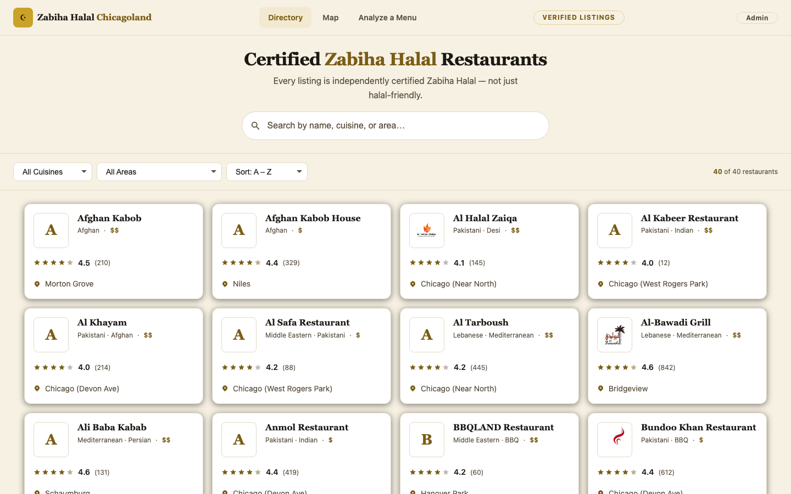
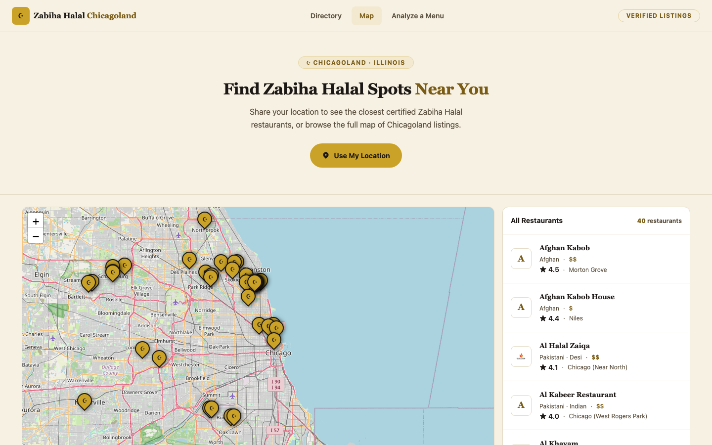
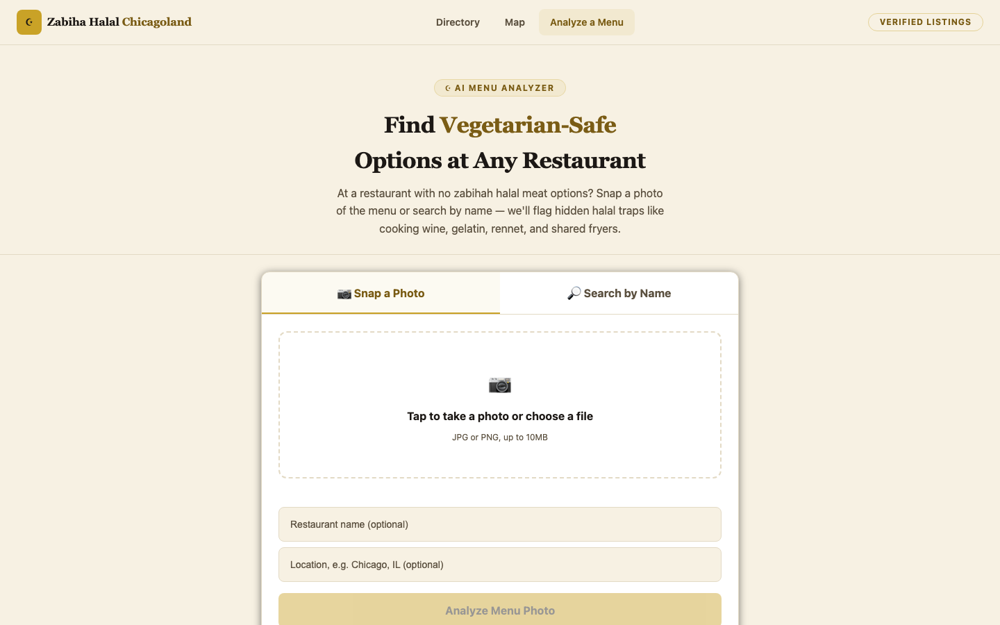
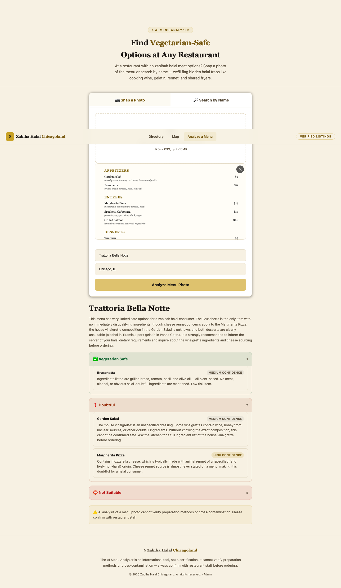
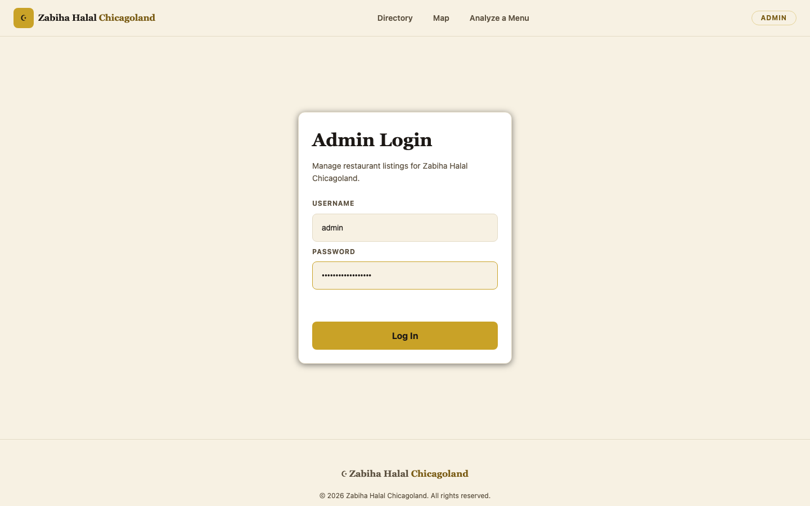
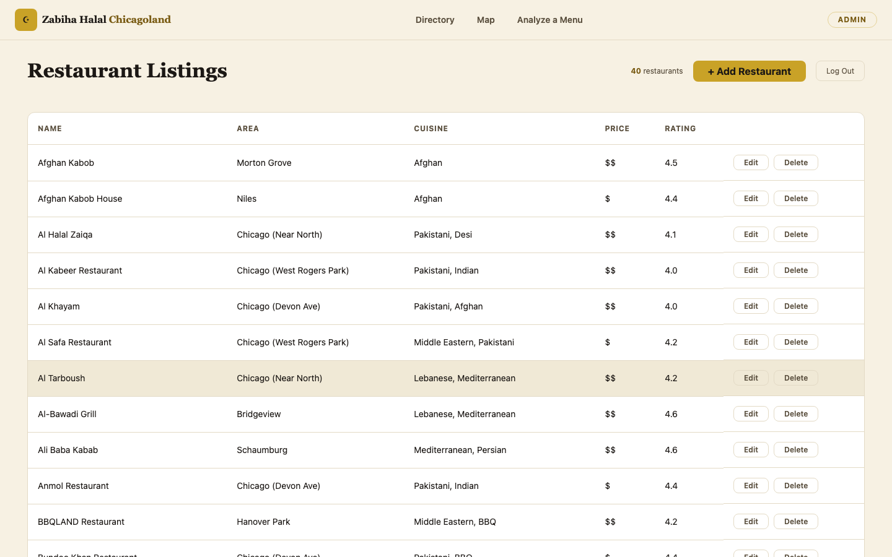
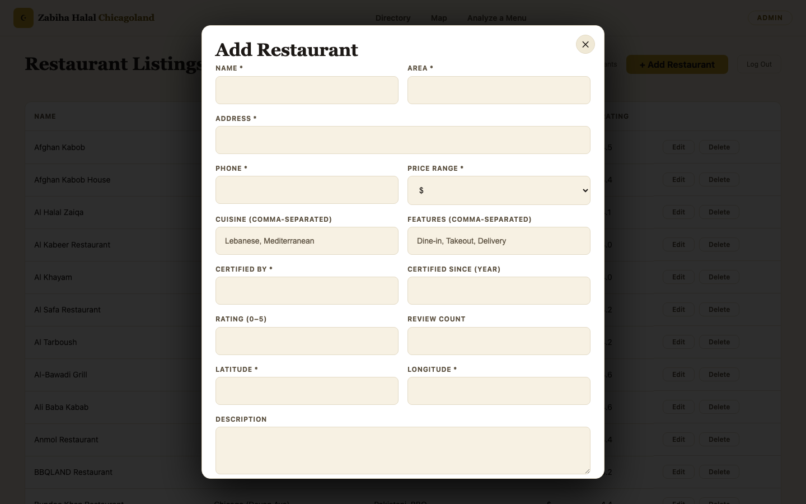

# 4. System Usage Guide

[← Back to index](README.md)

*This section is written for end users — no programming knowledge required.*

## 4.1 What this app does

Zabiha Halal Chicagoland helps you find halal-certified restaurants across the Chicago area, see them on a map, and — for the times you're stuck at a restaurant that *isn't* halal-certified — get an AI-powered breakdown of which menu items are safe to eat.

## 4.2 Accessing the application

| What | Where |
|---|---|
| **Live site** | https://delightful-moss-0894fe210.7.azurestaticapps.net |
| **Mobile** | Not on an app store — a live demo build is loaded through the **Expo Go** app (free, iOS App Store / Google Play). Open Expo Go, scan the project's QR code (from whoever is running the demo session), and the site opens full-screen on your phone. |
| **Account needed for browsing?** | No — the restaurant directory, map, and Menu Analyzer are all open to anyone, no sign-up or login required. |
| **Admin portal** | https://delightful-moss-0894fe210.7.azurestaticapps.net/admin.html — restricted to restaurant-listing administrators only (see §4.6). Also reachable via the "Admin" link in the site footer. |

### Test/demo credentials

The admin portal requires a username and password. Production credentials are intentionally **not published in this document** — they're managed as secrets and are only for the person(s) maintaining restaurant listings. If you need admin access, contact the project maintainer directly.

For developers running the app **locally** (see [02-system-setup.md](02-system-setup.md)), the out-of-the-box development login is:

| Field | Local dev default |
|---|---|
| Username | `admin` |
| Password | `admin-dev-password` |

This default only works on a locally-run copy of the Flask API with no `ADMIN_USERNAME`/`ADMIN_PASSWORD` environment variables set — it does **not** work against the live production site.

## 4.3 Navigating key features

### Restaurant Directory (home page)

- A grid of restaurant cards, each showing the name, logo/initial, cuisine tags, area, price range, and star rating.
- **Search box** (top of the page): type a restaurant name, area, or cuisine — the grid narrows as you type.
- **Cuisine** and **Area** dropdowns: filter to a specific cuisine or Chicagoland neighborhood/suburb. Combine with search and with each other.
- **Sort**: reorder results by name, rating, or price.
- **Clear filters**: appears once any filter is active; resets the view.
- Click any card to open a **detail popup** with full address, phone number, hours for every day of the week, features (dine-in/takeout/delivery/catering), and certifying body.

### Map view

- Click **"Map"** in the top navigation.
- Every restaurant is plotted as a marker; a sidebar list mirrors the markers.
- Click a marker or sidebar entry to open the same detail popup as the directory page.
- A "near me" / nearby-search option orders restaurants by distance if you share your location.

### AI Menu Analyzer

Click **"Analyze a Menu"** in the navigation. This feature is for restaurants that are **not** halal-certified, where you want an item-by-item read on what's realistically safe to order.

Two ways to use it (tabs at the top):

1. **Snap a Photo** (default tab)
   - Tap the upload area to choose a photo of a physical menu (JPG or PNG only, up to 10MB). On a phone, this opens your camera directly.
   - Optionally add the restaurant's name and location to help the analysis.
   - Click **"Analyze Menu Photo"**.
2. **Search by Name**
   - Type the restaurant's name (and optionally a location to disambiguate, e.g. "Chicago, IL").
   - Click **"Search"** — the app looks up the restaurant's menu online for you; no photo needed.

**Reading the results:** items are grouped by color:
- ✅ **Vegetarian Safe** (green)
- ⚠️ **Safe with Modification** (yellow) — shows exactly what to ask to have left off/changed
- ❓ **Doubtful** (orange) — ask staff before ordering
- ⛔ **Not Suitable** (red, collapsed by default — click to expand)

Each item shows a confidence level (high/medium/low). A fixed disclaimer always appears below the results:

> "AI analysis of a menu photo cannot verify preparation methods or cross-contamination. Please confirm with restaurant staff."

**If a restaurant's already been analyzed**, a repeat search shows results instantly with a "Previously analyzed — from our database" note, instead of re-running the AI.

**If the app can't find a menu online** for a name-only search, it offers a one-click "Snap a Photo Instead" button to switch modes.

**Example result** (real AI classification of an uploaded menu photo — restaurant and menu shown for illustration):

### Ordering, reservations, and menu management

The backend supports customer accounts, online ordering, table reservations, and full menu/category management via a REST API (documented in [`backend/docs/api-documentation.md`](../backend/docs/api-documentation.md)) — but **there is currently no customer-facing web page for placing an order or booking a reservation.** These capabilities exist and are fully tested at the API level (see [01-production-support.md](01-production-support.md)), but are not yet exposed as a feature in the public site. See §4.5 for this limitation.

## 4.4 Main workflow — "I'm at a non-halal restaurant, what can I eat?"

1. Open the site, click **"Analyze a Menu."**
2. If you have the physical menu in front of you: photograph it (well-lit, text readable, not blurry) and upload it under **"Snap a Photo."** Otherwise, switch to **"Search by Name"** and type the restaurant's name.
3. Submit and wait a few seconds for results (longer the first time a restaurant is analyzed; instant on repeat visits).
4. Scan the green and yellow groups first for safe/adjustable options. Check the orange "Doubtful" group and ask staff directly about anything there before ordering.
5. Always treat the result as a starting point, not a certification — confirm anything uncertain with restaurant staff, as the disclaimer states.

## 4.5 Known limitations / "gotchas"

- **No ordering or reservation UI yet.** The site is browse-and-decide only; you cannot place an order or book a table through the website today, even though the backend supports it.
- **Menu Analyzer results are AI-generated, not verified.** The AI cannot detect actual cross-contamination or confirm exact ingredients/preparation with the kitchen — always double-check anything flagged "Doubtful" with staff.
- **First-time cold start.** If the site or Menu Analyzer feels slow to respond after a period of no traffic, that's expected — the backend services scale down when idle to save cost and take a few seconds to "wake up" on the next request. This is not an error.
- **Photo requirements.** Only JPG/PNG images under 10MB are accepted; other file types or larger images are rejected with an on-screen message before anything is uploaded.
- **"Demo Mode" badge.** If you see a "🧪 Demo Mode" badge on a Menu Analyzer result, the AI key wasn't configured in that environment and you're seeing a canned sample response, not a real analysis of your specific photo/restaurant. This should not appear on the live production site under normal operation.
- **Admin portal is single-account.** There's one shared admin login for managing restaurant listings, not individual staff accounts — treat the admin password like a shared master key, and note admin sessions expire after 8 hours.
- **No login/account system for regular visitors.** Browsing, searching, and using the Menu Analyzer never require an account; only the restaurant-listing admin portal has a login.

## 4.6 Admin portal (for restaurant-listing administrators)

1. Go to `/admin.html` (or click "Admin" in the site footer).
2. Log in with the admin username/password.
3. The dashboard lists every restaurant currently in the directory, with **Add**, **Edit**, and **Delete** actions.

4. **Add Restaurant**: opens a form for all listing fields (name, area, address, phone, price range, cuisines, features, certification, coordinates, hours for each day, description, website, logo). Required fields are marked with `*`.

5. **Edit**: opens the same form pre-filled with the restaurant's current data; save to update.
6. **Delete**: removes the listing immediately — there is no undo, so confirm before deleting.
7. Changes made here appear on the public directory and map right away (after a page refresh on the visitor's end).
8. **Log Out** ends your admin session immediately; sessions also expire automatically after 8 hours of the token being issued.

## 4.7 Support

For account/access issues (e.g. requesting admin credentials), bug reports, or feature questions, contact the project maintainer directly rather than through the site (there is no in-app support/contact form at this time). For technical/developer support, see the troubleshooting steps in [01-production-support.md](01-production-support.md) and the diagnosed-issue history in [03-issue-diagnosis.md](03-issue-diagnosis.md).
