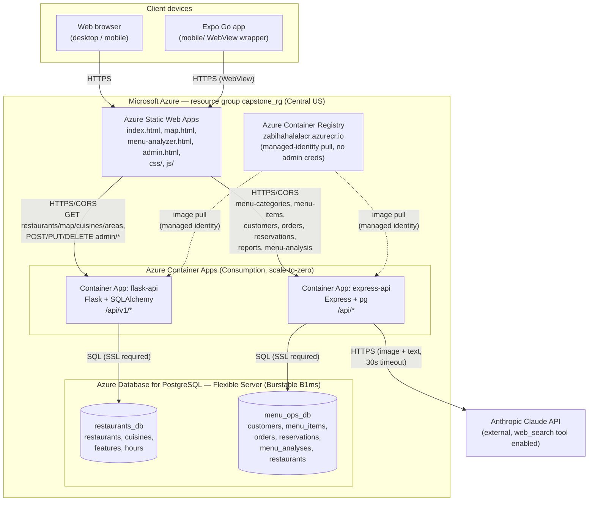
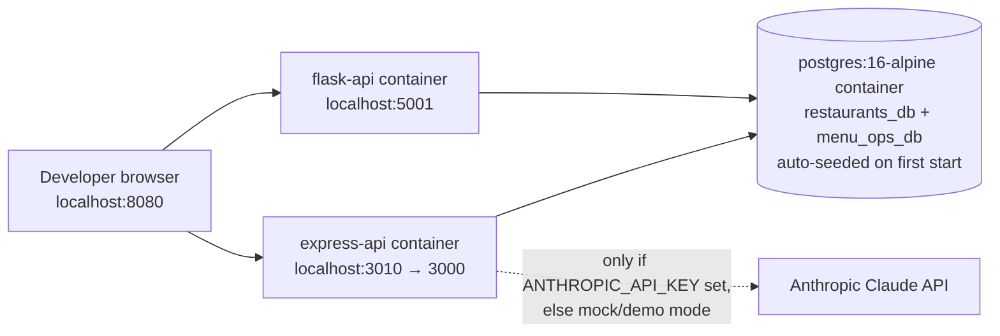

# 5. Architecture Diagram

[← Back to index](README.md)

## 5.1 System overview

Zabiha Halal Chicagoland is a **static frontend + two independent backend APIs + one shared database server** architecture, deployed on Microsoft Azure. There is no single monolithic "backend" — the two APIs are separately built, deployed, scaled, and versioned, and each owns its own logical database.

| Component | Role | Technology |
|---|---|---|
| Frontend | Restaurant directory, map, AI Menu Analyzer, admin portal (static site, no build step) | HTML/CSS/vanilla JS |
| Mobile | Thin WebView wrapper around the deployed frontend, demoed via Expo Go | Expo / React Native |
| Flask API | Restaurant directory, map, nearby search, admin restaurant CRUD | Python 3.12, Flask, SQLAlchemy |
| Express API | Menu management, customers, orders, reservations, admin reporting, AI Menu Analyzer | Node.js 20, Express, `pg` |
| Database | Two logical databases on one Postgres server | PostgreSQL 16 (Azure Database for PostgreSQL — Flexible Server) |
| AI | Menu photo/name classification, restaurant web search | Anthropic Claude API (`@anthropic-ai/sdk`) |
| Cloud platform | Hosting, container orchestration, image registry | Microsoft Azure (Static Web Apps, Container Apps, Container Registry, Postgres Flexible Server) |

## 5.2 High-level diagram (production)

## 5.3 Component responsibilities

| Component | Owns | Talks to |
|---|---|---|
| **Frontend** (`index.html`, `map.html`, `menu-analyzer.html`, `admin.html`, `js/`, `css/`) | All rendering, client-side validation, `js/api.js` (endpoint selection based on `location.hostname`) | Flask API (directory/map/admin) and Express API (menu/orders/reservations/AI) directly from the browser — **no backend-for-frontend / reverse proxy layer** |
| **Flask API** (`backend-flask/`) | Restaurant directory reads, nearby-search geolocation math, admin login + restaurant CRUD (bearer-token gated) | `restaurants_db` only |
| **Express API** (`backend/`) | Menu categories/items, customers, orders (transactional), reservations, admin reports, AI Menu Analyzer (cache-first, then Claude) | `menu_ops_db` only, plus outbound calls to the Anthropic Claude API |
| **Anthropic Claude API** | Menu photo classification, name-based restaurant/menu web search | Called only by the Express API's `aiMenuService.js`; never called directly from the browser (API key never reaches the client) |
| **Postgres Flexible Server** | Durable storage — two independent logical databases on one server instance (kept separate because both apps independently define an unrelated `restaurants` table) | Reached only from the two Container Apps; not exposed to the browser |
| **Azure Container Registry** | Stores both backend container images | Pulled from by Container Apps via system-assigned managed identity |
| **mobile/** | Demo-only native shell; contains no business logic | Loads the same Static Web Apps URL as any browser |

## 5.4 Communication flows

1. **Browse/search/map (read path):** Browser → Static Web Apps (serves static assets) → `js/api.js` issues `fetch()` calls directly to `flask-api`'s `/api/v1/*` endpoints → Flask queries `restaurants_db` → JSON response rendered client-side.
2. **Menu/order/reservation management (read/write path):** Browser → `express-api`'s `/api/*` endpoints → `menu_ops_db`, with order creation wrapped in a single DB transaction across `orders` + `order_items`.
3. **AI Menu Analyzer:** Browser uploads a photo and/or restaurant name → `express-api` `POST /api/menu-analysis` → checks `menu_ops_db` for a cached analysis first (`source: "cache"`, no AI call) → on a cache miss, calls the Anthropic Claude API (with the `web_search` tool for name-only or restaurant-verification lookups) → persists the result and returns it.
4. **Admin writes:** Browser → `admin.html`/`js/admin.js` → `POST /api/v1/admin/login` (Flask, username/password → signed bearer token, 8-hour expiry) → subsequent `POST`/`PUT`/`DELETE /api/v1/admin/restaurants/*` calls carry `Authorization: Bearer <token>`.
5. **Container image delivery:** Developer builds and pushes images to Azure Container Registry → Container Apps pull the latest tagged image via managed identity → no registry credentials are stored in app config.

## 5.5 Hosting/deployment environments

| Environment | Frontend | Flask API | Express API | Database |
|---|---|---|---|---|
| **Local (dev/test)** | `python3 -m http.server 8080` (or any static server) from the repo root | Docker container (`docker compose up`) on `localhost:5001`, or `python run.py` outside Docker | Docker container on `localhost:3010`→`3000` internally (or `localhost:3000` via `npm start`) | Local `postgres:16-alpine` container (`docker-compose.yml`), auto-seeded via `docker/postgres-init/` |
| **Test (CI-style, local)** | N/A | N/A | Jest + Supertest against a real Postgres test database, reset per test file | Separate Postgres database referenced by `TEST_DATABASE_URL` (never the dev database) |
| **Production** | Azure Static Web Apps (`delightful-moss-0894fe210.7.azurestaticapps.net`) | Azure Container App `flask-api` | Azure Container App `express-api` | Azure Database for PostgreSQL Flexible Server (`zahbhiahalal.postgres.database.azure.com`), two logical databases |

`js/api.js` is the single switch point between environments: it checks `location.hostname` at runtime and points at `localhost` URLs when not served from the production domain, so the same static frontend code runs unmodified in every environment — no build-time environment injection is needed.

## 5.6 Local development architecture (Docker Compose)

See [`docker-compose.yml`](../docker-compose.yml) for exact service definitions and [02-system-setup.md](02-system-setup.md) for full local setup steps.
